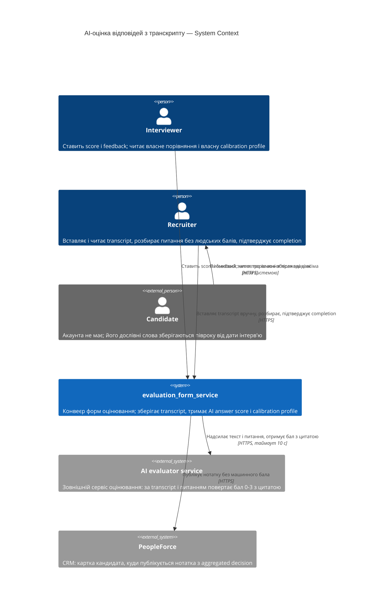
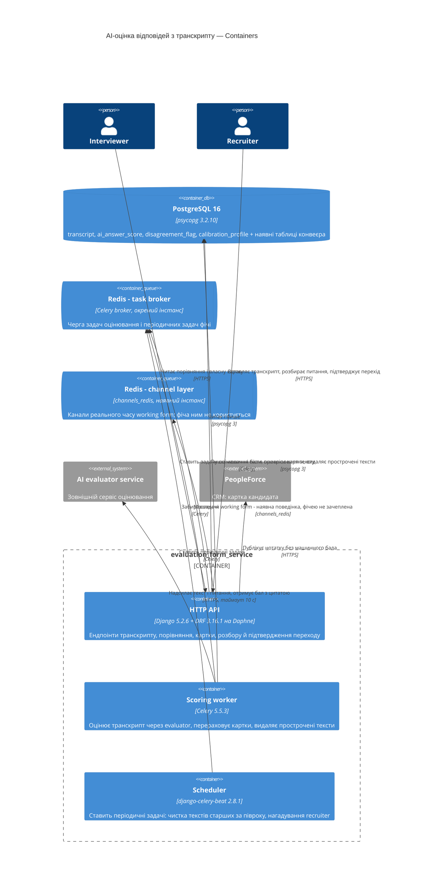
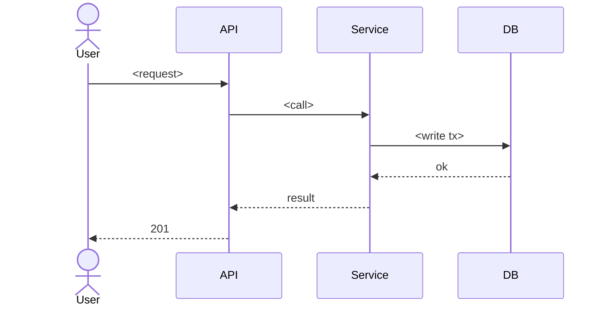

# Software Architecture Document — AI-оцінка відповідей кандидата з транскрипту

<!-- Stages 04-05 → see sdlc/plugin/skills/architecture-design/SKILL.md -->
<!-- 12 Arc42 sections. Empty sections — <!-- N/A: <one-line reason> -->. -->
<!-- C4 Context (L1) lives inline in §3. C4 Container (L2) lives inline in §5. -->
<!-- §6 Runtime view seeds the primary flow(s) here; complete-sequence-diagrams (stage 06) then -->
<!--    fills §6 with every critical flow / §5 AC — no cap. -->
<!-- Numbers in §10 come VERBATIM from PRD §6 NFR — no inventing, no rounding. -->

## 1. Introduction and goals

<!-- 🎯 Навіщо: стабільна памʼять про «що + три головні якості + хто зацікавлений».     -->
<!--           Через рік ніхто не згадає на словах, ЯКІ ТРИ ЯКОСТІ для системи критичні. -->
<!-- 📋 Що писати: 1 абзац intent + 3 рядки топ-3 якості + таблиця stakeholders.        -->
<!-- 📌 Приклад: «QG-1: швидкість редагування блоку p95 ≤500 мс»                         -->

**Intent.** Фіча дає кожному interviewer другу думку по тих самих відповідях кандидата, виведену
машиною з дослівного тексту інтерв'ю незалежно від людей, і накопичує з цих розходжень calibration
profile. Машина не видна до здачі фідбеку всіма, ніколи не входить в aggregated decision і ніколи не
переписує зданий фідбек. Recruiter дістає видимість розходжень і новий обов'язок: сказати, чи буде
текст, перш ніж оцінювання замкнеться. Джерело: PRD §2 Goals + §1 Context.

**Top-4 quality goals (1-liners; full scenarios in §10):**

1. **Ізольованість конвеєра від збою машинного оцінювання** — жоден сценарій найму не залежить від
   того, чи працює AI evaluator (PRD §7: 100% сценаріїв найму проходять без тексту інтерв'ю;
   доступність 99.0% на місяць рахується окремо від конвеєра).
2. **Незмінність уже виставленого** — машинний бал, пораховане розходження і частка збігів не
   змінюються ні від зникнення тексту (AC-16), ні від позначки незгоди (AC-10), ні від заміни версії
   AI evaluator (AC-24).
3. **Конфіденційність дослівного тексту** — текст читає лише recruiter, interviewer не має до нього
   жодного шляху (AC-08), і текст зникає сам через півроку від дати інтерв'ю (AC-16).
4. **Швидкодія читання агрегатів** — calibration profile відкривається за p95 ≤ 800 мс, попри те що
   вона є підрахунком по всіх завершених оцінюваннях одного interviewer за весь час (PRD §7).

<!-- Чому чотири, а не три: рішення власника 2026-09-09. Швидкодія картки внесена в топ саме тому, -->
<!-- що вона є агрегацією без природної межі росту і змушує §4/§5 явно вирішити питання             -->
<!-- денормалізації, а не відкласти його до першої скарги на повільний екран.                       -->

**Stakeholders.**

| Role | Interest | Sign-off owner? |
|---|---|---|
| interviewer | Отримує другу думку по своїх балах; його ж і вимірює calibration profile | No |
| recruiter | Прикріплює й читає transcript, розбирає питання без людських балів, підтверджує перехід у completion, бачить картки всіх interviewer | No |
| candidate | Його дослівні слова зберігаються півроку; має право дізнатись, що саме система тримає (AC-29) | No |
| hiring manager | Біль названий у PRD §1, але прав у цьому обсязі не отримує (PRD §3 non-goal) | No |
| Tech Lead / Architect | Затвердження SAD і ADR | Yes |

<!-- Decision overrides (¶4) — populated by the Step-7 critic resolution loop, empty otherwise.       -->
<!-- Each: «Decision override: <headline> — rationale: <reason>» so downstream skills see the choice.  -->

## 2. Constraints

<!-- 🎯 Навіщо: §4 (стратегія) працює тільки коли §2 зафіксувала, ЩО ВЖЕ ЗАФІКСОВАНО:    -->
<!--           стек, версії, дедлайн, регуляторні вимоги. Це вхід, не вихід.             -->
<!-- 📋 Що писати: чотири блоки — Технічні / Організаційні / Конвенції / Регуляторні.     -->
<!-- 📌 Приклад: «Postgres 18» (не «Postgres»); «дедлайн Q3 — жорсткий» (не «бажано»).    -->

**Technical.** (прочитано з репозиторію — версії з `requirements.txt`, `Dockerfile`, `docker-compose.yaml`)

- **Python 3.12.11** — базовий образ `python:3.12.11-slim` (`Dockerfile:1`). Це runtime, і саме він є
  обмеженням. Локальна `.venv` — 3.13.2; розбіжність зафіксована рядком у §11.
- Django 5.2.6 · djangorestframework 3.16.1 · drf-spectacular 0.28.0 · drf-nested-routers 0.95.0 ·
  djangorestframework_simplejwt 5.5.1 · django-filter 25.1
- PostgreSQL 16.0-alpine через psycopg 3.2.10
- Redis (alpine) несе **три ролі одночасно**: channel layer для Channels, Celery broker, result backend
- Celery 5.5.3 + django-celery-beat 2.8.1 (`DatabaseScheduler`) · Channels 4.3.1 + Daphne 4.2.1 (ASGI)
- `requests` 2.32.5 — єдиний HTTP-клієнт у репозиторії; зразок вихідної інтеграції — `PeopleForceService`
  (`evaluation_form/services.py:129`)
- Шарування: тонкі `views.py` → `services.py` (бізнес-логіка, транзакції, багатомодельні сценарії) →
  `models.py`; доступ окремо в `permissions.py`
- Конвеєр стадій: кожна стадія є **копією** попередньої без FK назад (`stage clone`, кореневий CONTEXT.md)

**Organisational.**
- Жорсткого дедлайну немає. Обмеження є **передумовами запуску** з PRD §12, а не датою: форма згоди
  кандидата й замір baseline згоди між interviewer мають бути готові до збору першого тексту.
- Склад: один розробник. Власник — Andrii Rykhliuk, тікет AI-7.
- Розмір фічі — L (`.size`): 15+ PR, кросмодульна, можливі breaking changes для споживачів.

**Conventions.**
- `CLAUDE.md` (корінь) + `.claude/rules/` — правила підвантажуються за шляхом файлу, не всі одразу.
- Заборонено: мутації у `views.py`/серіалізаторах · `group_send` у `services.py` · голий `.count()` на
  list-ендпоінтах (є `working_form/utils.py:prefetch_count()`) · багаторядкові мутації без
  `@transaction.atomic`.
- `flake8` мусить виходити з **нулем** знахідок — це єдиний надійний сигнал регресії в репо
  (`setup.cfg`; E203/W503/E501 вимкнені свідомо, max-complexity свідомо не вмикали).
- `black` з шириною 88. Плагінні гейти: `fields = "__all__"` заборонено; кожен API-клас несе
  `permission_classes` або `get_permissions()`.
- Міграції, які git уже відстежує, не редагуються.

**Regulatory / external.** (з PRD §8 Security and privacy review)
- Класифікація даних — **confidential**. Система вперше починає тримати дослівні слова людини, яка не
  має тут акаунта.
- Правова підстава — окрема форма згоди кандидата на запис і машинну обробку інтерв'ю. Точна назва й
  пункт документа встановлюються до запуску (PRD §12, відкрите).
- Retention: **півроку від дати інтерв'ю** для тексту. Машинні бали, calibration profile і позначки
  незгоди переживають видалення тексту.
- Право кандидата на перелік збережених про нього даних — обов'язкове й збирається одним екраном (AC-29).
- Вердикт огляду безпеки: **потрібен**. Це єдина фіча репозиторію з наслідками поза компанією.
- PRD §7 уже припускає **зовнішній сервіс оцінювання** (таймаут 10 c, одна повторна спроба) — тобто
  дослівний текст кандидата залишає периметр компанії. Тут це зафіксовано як факт; рішення, куди саме
  він їде і на яких умовах, ухвалюється в §4.

## 3. Context and scope

<!-- 🎯 Навіщо: малює КОРДОН СИСТЕМИ — хто з нею говорить ззовні, де закінчується зона довіри. -->
<!--           Без §3 §5 і §8 (авторизація) розпливаються — неясно, що «всередині», а що «зовні». -->
<!-- 📋 Що писати: 2-3 речення бізнес-контексту + таблиця зовнішніх систем + Mermaid C4Context. -->
<!-- 📌 Приклад: «зовнішні — нема (свідома відмова від third-party у v1)» — це теж рішення.   -->
<!-- Кордон довіри (trust boundary) — лінія, за якою ти не довіряєш даним без перевірки.       -->

Сервіс веде форми оцінювання технічних співбесід: команда наймання будує working form під вакансію,
а на кожного кандидата створюється заморожена evaluation form зі scores і feedback. Ця фіча додає в
третю стадію другу думку: recruiter вручну вставляє дослівний transcript, зовнішній AI evaluator
виводить із нього AI answer score на кожне питання, і система накопичує з розходжень calibration
profile по кожному interviewer. Кордон довіри (лінія, за якою даним не вірять без перевірки) проходить
двічі: на вході — вставлений людиною текст, який ніхто не валідував; на виході — відповідь зовнішньої
моделі, яку не можна пускати ні в aggregated decision, ні в нотатку CRM.

**External actors and systems (in / out):**

| Actor or system | Type | Interaction |
|---|---|---|
| interviewer | Person | Ставить `score` і `feedback`; після здачі всіма читає своє порівняння і власну calibration profile. Transcript не бачить ніколи (AC-08) |
| recruiter | Person | Вставляє, замінює й читає transcript; розбирає питання без людських балів; підтверджує перехід у completion; читає картки всіх interviewer; запускає CRM sync |
| candidate | Person (external) | Акаунта в системі не має. Його дослівні слова зберігаються півроку; письмовий запит про власні дані надходить **поза системою** і обслуговується recruiter'ом (AC-29) |
| AI evaluator service | System (external) | **Новий залежник.** Отримує текст і питання, повертає бал 0-3 з цитатою й номером рядка. Таймаут 10 c, одна повторна спроба (PRD §7) |
| PeopleForce | System (external) | Наявний. Отримує нотатку з aggregated decision і посиланням на звіт; машинного бала в нотатці немає (AC-27) |

`hiring manager` у діаграмі відсутній свідомо: PRD §3 називає видимість для нього non-goal, тож у цьому
обсязі він із фічею не взаємодіє.

**C4 Context (L1):**



## 4. Solution strategy

<!-- 🎯 Навіщо: 3-4 СТРАТЕГІЧНІ СТОВПИ, з яких потім ростуть усі ADR. Без §4 кожен ADR    -->
<!--           виглядає випадковим — нема зонтика. ⭐ Найгустіша секція — тут ADR-gate    -->
<!--           спрацьовує майже завжди (рішення незворотні + мульти-модульні).            -->
<!-- 📋 Що писати: спершу Target surface(s), потім 3-4 стратегічні вибори.                -->
<!--           На кожен — заголовок + 2-3 речення rationale.                              -->
<!-- 📌 ПЕРШЕ рішення §4 — Target surface(s): ЩО САМЕ будуємо. Записується у frontmatter   -->
<!--           target_surfaces: [...] і гейтить §5 (один контейнер на поверхню) + усі       -->
<!--           наступні стадії. Деривиться з PRD §1 «для кого» + §4 ролей. → _shared/surfaces.md -->
<!-- 📌 Приклад: «Зберігати урок як таблицю блоків» — стовп, з якого виросло ADR-0001.    -->

**Target surface(s) (перше рішення — що саме будуємо):** `[backend-service, worker]` → **ADR-0001**

Бекенд-сервіс несе нові ендпоінти (прикріпити й замінити текст, віддати порівняння, віддати картку,
позначити незгоду, розібрати питання без людських балів, підтвердити перехід). Фоновий воркер несе
саме оцінювання: він уже існує в `docker-compose` (сервіси `celery` і `celery-beat`), але зараз тримає
одну дрібну задачу. Він оголошений **окремою поверхнею**, бо PRD §7 вимагає рахувати доступність
машинного оцінювання (99.0% на місяць) **окремо від конвеєра** — а окремий показник доступності має
сенс лише тоді, коли це окремий процес із власним життєвим циклом.

`web-frontend` **свідомо не оголошено.** Репозиторій без фронтенду за задумом (`CLAUDE.md`: «No frontend
here — REST plus one WebSocket channel»), і жодної дизайн-системи, компонентної бібліотеки чи токенів у
ньому немає. Критерії PRD, написані через «екран порівняння» / «екран картки» / «екран розбору»,
перевіряються на рівні відповіді API: тест звертається до ендпоінта під конкретною роллю і перевіряє,
що там рівно те, що ця роль має бачити. Побудова UI — окрема робота поза цим SAD.

**Top strategic choices (насіння для ADR):**

1. **Машинна оцінка — окрема сутність, паралельна людській** → **ADR-0002**. `AI answer score` не
   лягає в `EvaluationScore`: він не рахується проти `max score`, не входить в `aggregated decision` і
   не тримає питання від видалення на completion. Причина не стилістична: `check_and_complete_evaluation()`
   видаляє питання за умовою `scores__isnull=True`, тож машинний рядок у тій самій таблиці мовчки
   скасував би AC-18 без жодного рядка коду про це. Версія AI evaluator зберігається полем на кожному
   машинному балі — це і є механізм AC-24.
2. **Обробка транскрипту повністю асинхронна і не стоїть у жодному синхронному шляху найму** →
   **ADR-0001**. Прикріплення тексту лише ставить задачу в чергу; жоден запит користувача не чекає на
   модель. Це і є QG-1: доступність AI рахується окремо, бо вона й архітектурно окрема, а вимкнення
   машини не ламає жодного сценарію найму (PRD §7: 100% сценаріїв проходять без тексту).
3. **Виклик зовнішнього evaluator ізольований в один адаптер** за зразком наявного `PeopleForceService`
   (`evaluation_form/services.py:129`) — той самий `requests`, той самий шар, та сама форма коду.
   Таймаут 10 c і одна повторна спроба (PRD §7). **Де саме живе evaluator і чи покриває згода кандидата
   передачу тексту третій стороні — відкрите питання, рядок у §11**; форма адаптера від відповіді не
   залежить, а форма контейнера в §5 залежить, тому §5 малює його зовнішнім за чинним PRD §7.
4. **Calibration profile матеріалізується інкрементно** → **ADR-0003**. Картка зберігається рядком і
   перераховується у трьох точках: завершення оцінювання, позначка незгоди (AC-09), заміна тексту
   (AC-13). Це тримає QG-4 (p95 ≤ 800 мс на агрегації без межі росту) і водночас робить AC-24
   структурно неможливим порушити: вже записана частка не може змінитись від заміни моделі, бо її ніхто
   не виводить заново.
5. **Completion стає двофазним через новий статус форми** → **ADR-0004**. Між `IN_PROGRESS` і
   `COMPLETED` з'являється стан очікування рішення recruiter про текст (AC-19, AC-21). Це найризикованіша
   зміна документа: вона розрізає навпіл єдине місце системи, де видалення справжнє, а не м'яке, і
   стосується форм, які фічею взагалі не користуються.

Кожне тактичне рішення нижче має простежуватись до одного з цих стовпів. Тактичне рішення, яке
**суперечить** стовпу, є червоним прапорцем і виноситься в §11 Risks.

## 5. Building block view

<!-- 🎯 Навіщо: ВНУТРІШНЯ ДЕКОМПОЗИЦІЯ — модулі, контейнери, БД. Статична топологія:   -->
<!--           хто з ким може говорити. Без §5 §6 (сценарії) не має словника учасників. -->
<!-- 📋 Що писати: 1 абзац про стиль (шари/гексагональна/clean/на подіях) +            -->
<!--           дерево папок + Mermaid C4Container.                                       -->
<!-- 📌 ОДИН Container на кожну оголошену target_surface (frontmatter): fullstack        -->
<!--           [backend-service, web-frontend] = backend-API container + web/SPA container; -->
<!--           [backend-service, mobile-app] = API + mobile app. Container(web, …) нижче — -->
<!--           лише приклад однієї поверхні; додай/заміни під оголошене у §4. → _shared/surfaces.md -->
<!-- 📌 Приклад: «web-app, content-api, media-worker, postgres, s3, cdn».                -->

Стиль **шаровий**, успадкований від репозиторію без відхилень: тонкі `views.py` (авторизація,
пагінація, серіалізація) → `services.py` (бізнес-логіка, транзакції, багатомодельні сценарії) →
`models.py` (ORM, валідатори). Доступ живе окремо в `permissions.py`. Гексагональну чи чисту архітектуру
тут не вводимо: PRD не сигналізує потреби відхилятись, а розходження з конвенцією репозиторію коштувало б
дорожче за будь-яку вигоду.

Код фічі живе в **новому Django-застосунку `ai_scoring`** (**ADR-0005**). Наявний `evaluation_form`
змінюється рівно двічі — і жодного разу більше.

**Internal decomposition:**

```
ai_scoring/                  новий застосунок: усе, чого до фічі не існувало
├── models.py                Transcript · AIAnswerScore · DisagreementFlag · CalibrationProfile
├── evaluator.py             адаптер до зовнішнього AI evaluator, за формою PeopleForceService
├── services.py              оцінювання, перерахунок картки, розбір питань без людських балів
├── tasks.py                 Celery: оцінити транскрипт · видалити прострочені тексти · нагадати recruiter
├── permissions.py           транскрипт лише recruiter · картка лише власна · бали лише після здачі всіма
├── serializers.py
├── views.py                 тонкі ендпоінти
├── urls.py
└── migrations/

evaluation_form/             зміни в наявному застосунку - рівно дві
├── models.py                + нове значення Status (ADR-0004)
└── services.py              check_and_complete_evaluation() розрізається надвоє: «усі здали» окремо
                             від «замкнути й видалити невідповідані питання»
```

**C4 Container (L2):** контейнери відповідають **запускним одиницям**, а не Django-застосункам: один
контейнер на кожну оголошену поверхню (`backend-service` → HTTP API, `worker` → Celery-виконавець) плюс
планувальник, який уже є в `docker-compose`.



**Два Redis замість одного — свідоме рішення фічі** (**ADR-0006**). Сьогодні один інстанс несе три ролі
(канали реального часу, брокер Celery, сховище результатів) — це зафіксовано в §2 як стан репозиторію.
Фіча вводить довгі задачі, кожна з яких чекає до 10 секунд на зовнішню модель, тому черга оцінювання
переїжджає на **окремий інстанс**: сплеск оцінювань не має гальмувати спільне редагування working form.
Логічної бази всередині того самого процесу для цього замало — вона розділяє простір ключів, але не
процесорний час і не пам'ять.

**Що навмисно не намальовано.** Розміщення `AI evaluator service` показано зовнішнім за чинним PRD §7;
якщо відкрите питання в §11 закриється відповіддю «самохост», цей елемент перестане бути `System_Ext` і
переїде всередину межі. Це єдина частина діаграми, яку може змінити невирішене питання.

## 6. Runtime view

<!-- 🎯 Навіщо: ПОТІК У RUNTIME для 1-2 критичних сценаріїв. Хто з ким коли і у якому     -->
<!--           порядку говорить. Без §6 §5 — лише купа коробок без життя.                  -->
<!-- 📋 Що писати: Mermaid sequenceDiagram. Учасники — імена з §5 (не вигадуй нові!).      -->
<!--           Повідомлення семантичні («складає чорновик»), БЕЗ HTTP-методів/шляхів —     -->
<!--           ендпоінт-рівневі sequence-діаграми зʼявляться у stage 06 (api-forge).        -->
<!-- ⏳ RESERVED FOR SEQUENCES: architecture-design сіє лише primary flow(s) тут.          -->
<!--           complete-sequence-diagrams (stage 06) ДОПОВНЮЄ §6 кожним критичним flow /    -->
<!--           кожним §5 AC — без обмеження. Не намагайся покрити все тут.                  -->
<!-- 📌 Приклад: «methodist → web-app: складає чорновик → web-app → content-api: зберегти». -->

**Critical flow 1: <flow name>**



<!-- For XS/S: 1 flow above is enough. For M+: add 2-4 more (e.g. failure-mode flow, async flow). -->

**Critical flow 2: <e.g. async event propagation>** — <if applicable, otherwise N/A>.

## 7. Deployment view

<!-- 🎯 Навіщо: ТОПОЛОГІЯ, яку DevOps має знати без читання Helm-чартів — скільки реплік,  -->
<!--           де живе фоновий обробник, ПРИ ЯКИХ ЧИСЛАХ масштабуємось.                     -->
<!-- 📋 Що писати: 2-3 речення про топологію + метрики + алерти + конкретні числа-пороги.   -->
<!-- 📌 Приклад: «500 IC → партиціонування за кварталом» (не «при зростанні подумаємо»).    -->
<!-- 🎯 Можна N/A для XS/S функцій, що переюзають існуюче розгортання без змін.            -->

<Topology in 2-3 sentences. Where it runs (k8s / VM / serverless), replicas, scaling thresholds.>

**Monitoring:**
- <Metrics — e.g. Prometheus `<metric_name>`>
- <Alerts — e.g. "outbox lag > 10 min → page on-call">
- <Tracing — e.g. OpenTelemetry HTTP spans>

**Scaling thresholds:**
- <e.g. 500 IC × 5 goals × 26 checkpoints/Q = 65k rows/year — comfortable in one table>
- <e.g. partitioning by quarter at >500k rows/year>

<!-- For XS/S that doesn't change deployment: <!-- N/A: feature reuses existing deployment unit -->. -->

## 8. Crosscutting concepts

<!-- 🎯 Навіщо: НАСКРІЗНІ ПАТЕРНИ, які перетинають кілька модулів: логування, помилки,    -->
<!--           авторизація, ID strategy, outbox, кеш. ⭐ Друга найгустіша секція.          -->
<!--           Якщо патерн всередині одного модуля — він НЕ сюди. Якщо це конвенція        -->
<!--           проєкту в цілому — у CLAUDE.md.                                              -->
<!-- 📋 Що писати: таблиця концепт / конвенція / де визначено. Один рядок на концепт.      -->
<!-- 📌 Приклад: «UUID v7 (час+випадковий, сортується) у app-layer» — як default з CLAUDE.md. -->

| Concept | Convention | Where defined |
|---|---|---|
| Logging | <e.g. structured slog, fields `module=<name>`> | <CLAUDE.md §X or here> |
| Authentication | <e.g. JWT via session middleware> | <CLAUDE.md §X> |
| Error handling | <e.g. domain sentinel → ports/errors.go → apperr JSON> | <CLAUDE.md §X> |
| ID strategy | <e.g. UUID v7 in app layer> | <CLAUDE.md §X> |
| Internationalisation | <e.g. N/A, English only> | — |
| Observability | <e.g. OpenTelemetry on HTTP boundaries> | — |
| Outbox / events | <module-specific patterns, if any> | <here> |

## 9. Architecture decisions

<!-- 🎯 Навіщо: ЗВОРОТНИЙ ІНДЕКС на папку adr/. `ls adr/` дає файли, §9 дає семантику —    -->
<!--           чому вони існують, до якого зрізу SAD привʼязані, у якому статусі.           -->
<!-- 📋 Що писати: таблиця з 4 колонками. Один рядок на ADR. Mixed status — це OK.         -->
<!-- 📌 Приклад: «0001 | Зберігати урок як таблицю блоків | Accepted | §4».                -->

| # | Title | Status | Section |
|---|---|---|---|
| <NNNN> | <imperative — e.g. "Use sliding window for rate limiting"> | Accepted | §<N> |
| <NNNN> | <imperative — e.g. "Co-locate outbox worker in API process"> | Accepted | §<N> |

ADR files live under `docs/features/<slug>/adr/NNNN-<title>.md`.

## 10. Quality requirements

<!-- 🎯 Навіщо: ДЕРЕВО ЯКОСТЕЙ (Quality Tree) — беремо мету з §1 і розкладаємо на          -->
<!--           конкретні листя: тести, метрики, конфіги, drill-и. ⭐ Без §10 §1 — це       -->
<!--           маніфест. З §10 кожна декларація мапиться на щось, ЩО МОЖНА ДОВЕСТИ.        -->
<!-- 📋 Що писати: на кожну якість з §1 — When / Then / How verify. Числа з PRD §6 NFR     -->
<!--           ДОСЛІВНО (не округлюй p95 ≤250мс до ≤300мс — це F6-помилка критика).        -->
<!-- 📌 Приклад: «p95 ≤500 мс на UPDATE блоку, перевіримо k6 load test 100 req/s».        -->

Each top-3 goal from §1 expanded into a full scenario:

**QG-1. <quality attribute>**
- **When:** <trigger condition>
- **Then:** <expected behavior with numbers from PRD NFR>
- **How verify:** <test / chaos drill / load test / observability>

**QG-2. <quality attribute>**
- **When:** <trigger>
- **Then:** <expected>
- **How verify:** <how>

**QG-3. <quality attribute>**
- **When:** <trigger>
- **Then:** <expected>
- **How verify:** <how>

## 11. Risks and technical debt

<!-- 🎯 Навіщо: ⭐ збирає ВСЕ, що може зламатись — і не лише технічне. Без §11 ризики   -->
<!--           обговорюються на стендапах і губляться; борг лишається у голові того,    -->
<!--           хто його прийняв.                                                          -->
<!-- 📋 Що писати: таблиця ризик/борг — серйозність — мітигація — власник. Технічний    -->
<!--           борг окремою секцією.                                                      -->
<!-- 📌 Приклад: «EM не пушить — member не оновлює дані | High | …». Перший ризик —      -->
<!--           часто продуктовий, не технічний. Це нормально.                            -->

<!-- Severity column literals: Low / Medium / High for regular risks; "Open question" for rows
     created by Step-7 `Save as Open Question` resolutions (see references/socratic-loop.md). -->

| Risk / debt | Severity | Mitigation | Owner |
|---|---|---|---|
| <e.g. Outbox lag may reach hours during downstream outage> | Medium | <Alert >10 min, on-call playbook, retry backoff> | <DevOps> |
| <e.g. No event schema versioning in v1> | Medium | <ADR-NNNN planned for v2, graceful handling of unknown fields> | <Backend> |
| Open architectural decision: <decision-headline> | Open question | Resolve before <stage trigger or YYYY-MM-DD>; <inline rationale from Step-7 Save-as-OQ> | <owner> |

**Accepted debt (acceptable in v1, plan to fix later):**
- <e.g. Goal entity is not versioned (immutable) — OK for v1, may need audit versioning in v2>

## 12. Glossary

<!-- 🎯 Навіщо: ⭐ СЛОВНИК ДОМЕНУ, який припиняє суперечки через рік («checkpoint —      -->
<!--           weekly чи biweekly? Quarter — календарний чи фіскальний?»).                -->
<!-- 📋 Що писати: таблиця термін / значення. Бізнес-терміни + технічні вперемішку.       -->
<!--           Один термін може мати дві мови у заголовку: «Goal (Обʼєктив)».              -->
<!-- 📌 Приклад: «Lesson | урок усередині курсу, що складається з блоків (text, video)». -->

| Term | Meaning |
|---|---|
| <e.g. Goal> | <quarterly intent in statement form> |
| <e.g. KR> | <Key Result — measurable target linked to a Goal> |
| <e.g. Checkpoint> | <bi-weekly progress update on a KR> |
