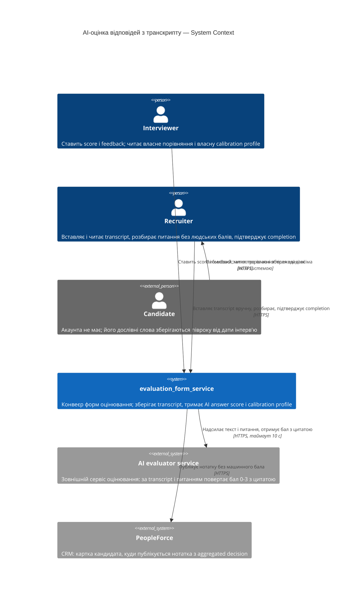
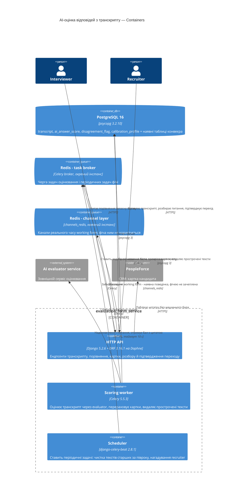
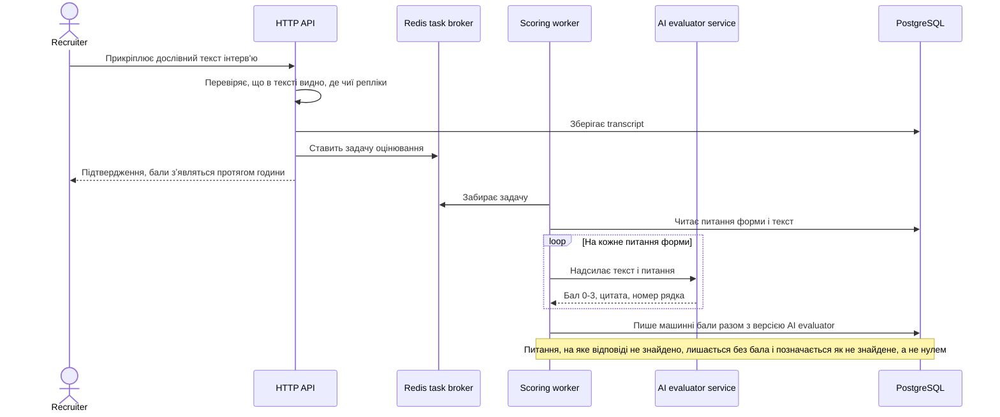
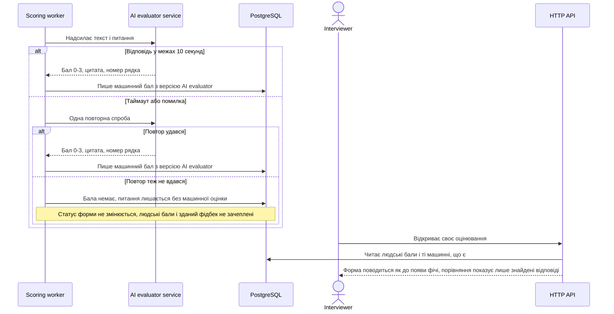

# Software Architecture Document — AI-оцінка відповідей кандидата з транскрипту

<!-- Stages 04-05 → see sdlc/plugin/skills/architecture-design/SKILL.md -->
<!-- 12 Arc42 sections. Empty sections — <!-- N/A: <one-line reason> -->. -->
<!-- C4 Context (L1) lives inline in §3. C4 Container (L2) lives inline in §5. -->
<!-- §6 Runtime view seeds the primary flow(s) here; complete-sequence-diagrams (stage 06) then -->
<!--    fills §6 with every critical flow / §5 AC — no cap. -->
<!-- Numbers in §10 come VERBATIM from PRD §6 NFR — no inventing, no rounding. -->

## 1. Introduction and goals

<!-- 🎯 Навіщо: стабільна памʼять про «що + три головні якості + хто зацікавлений».     -->
<!--           Через рік ніхто не згадає на словах, ЯКІ ТРИ ЯКОСТІ для системи критичні. -->
<!-- 📋 Що писати: 1 абзац intent + 3 рядки топ-3 якості + таблиця stakeholders.        -->
<!-- 📌 Приклад: «QG-1: швидкість редагування блоку p95 ≤500 мс»                         -->

**Intent.** Фіча дає кожному interviewer другу думку по тих самих відповідях кандидата, виведену
машиною з дослівного тексту інтерв'ю незалежно від людей, і накопичує з цих розходжень calibration
profile. Машина не видна до здачі фідбеку всіма, ніколи не входить в aggregated decision і ніколи не
переписує зданий фідбек. Recruiter дістає видимість розходжень і новий обов'язок: сказати, чи буде
текст, перш ніж оцінювання замкнеться. Джерело: PRD §2 Goals + §1 Context.

**Top-4 quality goals (1-liners; full scenarios in §10):**

1. **Ізольованість конвеєра від збою машинного оцінювання** — жоден сценарій найму не залежить від
   того, чи працює AI evaluator (PRD §7: 100% сценаріїв найму проходять без тексту інтерв'ю;
   доступність 99.0% на місяць рахується окремо від конвеєра).
2. **Незмінність уже виставленого** — машинний бал, пораховане розходження і частка збігів не
   змінюються ні від зникнення тексту (AC-16), ні від позначки незгоди (AC-10), ні від заміни версії
   AI evaluator (AC-24).
3. **Конфіденційність дослівного тексту** — текст читає лише recruiter, interviewer не має до нього
   жодного шляху (AC-08), і текст зникає сам через півроку від дати інтерв'ю (AC-16).
4. **Швидкодія читання агрегатів** — calibration profile відкривається за p95 ≤ 800 мс, попри те що
   вона є підрахунком по всіх завершених оцінюваннях одного interviewer за весь час (PRD §7).

<!-- Чому чотири, а не три: рішення власника 2026-09-09. Швидкодія картки внесена в топ саме тому, -->
<!-- що вона є агрегацією без природної межі росту і змушує §4/§5 явно вирішити питання             -->
<!-- денормалізації, а не відкласти його до першої скарги на повільний екран.                       -->

**Stakeholders.**

| Role | Interest | Sign-off owner? |
|---|---|---|
| interviewer | Отримує другу думку по своїх балах; його ж і вимірює calibration profile | No |
| recruiter | Прикріплює й читає transcript, розбирає питання без людських балів, підтверджує перехід у completion, бачить картки всіх interviewer | No |
| candidate | Його дослівні слова зберігаються півроку; має право дізнатись, що саме система тримає (AC-29) | No |
| hiring manager | Біль названий у PRD §1, але прав у цьому обсязі не отримує (PRD §3 non-goal) | No |
| Tech Lead / Architect | Затвердження SAD і ADR | Yes |

**Decision override (крок 7, резолюція знахідки критика).** Критик позначив варіант `web-frontend` у
переліку розглянутих в ADR-0001 як «страшмен» — альтернативу, яку чинне обмеження вже виключає. Знахідку
**прийнято частково**: варіант лишається в переліку, бо він був реальним вибором і його зважували, а
рядок `CLAUDE.md` «No frontend here» описує стан репозиторію, а не забороняє фронтенд. Переписано
натомість **обґрунтування відхилення** в ADR-0001: варіант відхилено за вартістю (UI довелося б будувати
з нуля разом із дизайн-системою), а не тому, що він був неможливий.

<!-- Decision overrides (¶4) — populated by the Step-7 critic resolution loop, empty otherwise.       -->
<!-- Each: «Decision override: <headline> — rationale: <reason>» so downstream skills see the choice.  -->

## 2. Constraints

<!-- 🎯 Навіщо: §4 (стратегія) працює тільки коли §2 зафіксувала, ЩО ВЖЕ ЗАФІКСОВАНО:    -->
<!--           стек, версії, дедлайн, регуляторні вимоги. Це вхід, не вихід.             -->
<!-- 📋 Що писати: чотири блоки — Технічні / Організаційні / Конвенції / Регуляторні.     -->
<!-- 📌 Приклад: «Postgres 18» (не «Postgres»); «дедлайн Q3 — жорсткий» (не «бажано»).    -->

**Technical.** (прочитано з репозиторію — версії з `requirements.txt`, `Dockerfile`, `docker-compose.yaml`)

- **Python 3.12.11** — базовий образ `python:3.12.11-slim` (`Dockerfile:1`). Це runtime, і саме він є
  обмеженням. Локальна `.venv` — 3.13.2; розбіжність зафіксована рядком у §11.
- Django 5.2.6 · djangorestframework 3.16.1 · drf-spectacular 0.28.0 · drf-nested-routers 0.95.0 ·
  djangorestframework_simplejwt 5.5.1 · django-filter 25.1
- PostgreSQL 16.0-alpine через psycopg 3.2.10
- Redis (alpine) несе **три ролі одночасно**: channel layer для Channels, Celery broker, result backend
- Celery 5.5.3 + django-celery-beat 2.8.1 (`DatabaseScheduler`) · Channels 4.3.1 + Daphne 4.2.1 (ASGI)
- `requests` 2.32.5 — єдиний HTTP-клієнт у репозиторії; зразок вихідної інтеграції — `PeopleForceService`
  (`evaluation_form/services.py:129`)
- Шарування: тонкі `views.py` → `services.py` (бізнес-логіка, транзакції, багатомодельні сценарії) →
  `models.py`; доступ окремо в `permissions.py`
- Конвеєр стадій: кожна стадія є **копією** попередньої без FK назад (`stage clone`, кореневий CONTEXT.md)

**Organisational.**
- Жорсткого дедлайну немає. Обмеження є **передумовами запуску** з PRD §12, а не датою: форма згоди
  кандидата й замір baseline згоди між interviewer мають бути готові до збору першого тексту.
- Склад: один розробник. Власник — Andrii Rykhliuk, тікет AI-7.
- Розмір фічі — L (`.size`): 15+ PR, кросмодульна, можливі breaking changes для споживачів.

**Conventions.**
- `CLAUDE.md` (корінь) + `.claude/rules/` — правила підвантажуються за шляхом файлу, не всі одразу.
- Заборонено: мутації у `views.py`/серіалізаторах · `group_send` у `services.py` · голий `.count()` на
  list-ендпоінтах (є `working_form/utils.py:prefetch_count()`) · багаторядкові мутації без
  `@transaction.atomic`.
- `flake8` мусить виходити з **нулем** знахідок — це єдиний надійний сигнал регресії в репо
  (`setup.cfg`; E203/W503/E501 вимкнені свідомо, max-complexity свідомо не вмикали).
- `black` з шириною 88. Плагінні гейти: `fields = "__all__"` заборонено; кожен API-клас несе
  `permission_classes` або `get_permissions()`.
- Міграції, які git уже відстежує, не редагуються.

**Regulatory / external.** (з PRD §8 Security and privacy review)
- Класифікація даних — **confidential**. Система вперше починає тримати дослівні слова людини, яка не
  має тут акаунта.
- Правова підстава — окрема форма згоди кандидата на запис і машинну обробку інтерв'ю. Точна назва й
  пункт документа встановлюються до запуску (PRD §12, відкрите).
- Retention: **півроку від дати інтерв'ю** для тексту. Машинні бали, calibration profile і позначки
  незгоди переживають видалення тексту.
- Право кандидата на перелік збережених про нього даних — обов'язкове й збирається одним екраном (AC-29).
- Вердикт огляду безпеки: **потрібен**. Це єдина фіча репозиторію з наслідками поза компанією.
- PRD §7 фіксує **параметри виклику сервісу оцінювання** (таймаут 10 c, одна повторна спроба), але не
  каже, чий це сервіс і де він працює. **Чи залишає дослівний текст периметр компанії — не вирішено:**
  це відкрите питання §11 із власником і дедлайном (закрити до `/sdlc-api-forge`). Доки воно відкрите,
  документ не стверджує ні того, ні протилежного, а форма згоди кандидата має називати саме те, що
  система робитиме насправді — і саме тому питання не можна закрити мовчазним припущенням.

## 3. Context and scope

<!-- 🎯 Навіщо: малює КОРДОН СИСТЕМИ — хто з нею говорить ззовні, де закінчується зона довіри. -->
<!--           Без §3 §5 і §8 (авторизація) розпливаються — неясно, що «всередині», а що «зовні». -->
<!-- 📋 Що писати: 2-3 речення бізнес-контексту + таблиця зовнішніх систем + Mermaid C4Context. -->
<!-- 📌 Приклад: «зовнішні — нема (свідома відмова від third-party у v1)» — це теж рішення.   -->
<!-- Кордон довіри (trust boundary) — лінія, за якою ти не довіряєш даним без перевірки.       -->

Сервіс веде форми оцінювання технічних співбесід: команда наймання будує working form під вакансію,
а на кожного кандидата створюється заморожена evaluation form зі scores і feedback. Ця фіча додає в
третю стадію другу думку: recruiter вручну вставляє дослівний transcript, зовнішній AI evaluator
виводить із нього AI answer score на кожне питання, і система накопичує з розходжень calibration
profile по кожному interviewer. Кордон довіри (лінія, за якою даним не вірять без перевірки) проходить
двічі: на вході — вставлений людиною текст, який ніхто не валідував; на виході — відповідь зовнішньої
моделі, яку не можна пускати ні в aggregated decision, ні в нотатку CRM.

**External actors and systems (in / out):**

| Actor or system | Type | Interaction |
|---|---|---|
| interviewer | Person | Ставить `score` і `feedback`; після здачі всіма читає своє порівняння і власну calibration profile. Transcript не бачить ніколи (AC-08) |
| recruiter | Person | Вставляє, замінює й читає transcript; розбирає питання без людських балів; підтверджує перехід у completion; читає картки всіх interviewer; запускає CRM sync |
| candidate | Person (external) | Акаунта в системі не має. Його дослівні слова зберігаються півроку; письмовий запит про власні дані надходить **поза системою** і обслуговується recruiter'ом (AC-29) |
| AI evaluator service | System (external) | **Новий залежник.** Отримує текст і питання, повертає бал 0-3 з цитатою й номером рядка. Таймаут 10 c, одна повторна спроба (PRD §7) |
| PeopleForce | System (external) | Наявний. Отримує нотатку з aggregated decision і посиланням на звіт; машинного бала в нотатці немає (AC-27) |

`hiring manager` у діаграмі відсутній свідомо: PRD §3 називає видимість для нього non-goal, тож у цьому
обсязі він із фічею не взаємодіє.

**C4 Context (L1):**



## 4. Solution strategy

<!-- 🎯 Навіщо: 3-4 СТРАТЕГІЧНІ СТОВПИ, з яких потім ростуть усі ADR. Без §4 кожен ADR    -->
<!--           виглядає випадковим — нема зонтика. ⭐ Найгустіша секція — тут ADR-gate    -->
<!--           спрацьовує майже завжди (рішення незворотні + мульти-модульні).            -->
<!-- 📋 Що писати: спершу Target surface(s), потім 3-4 стратегічні вибори.                -->
<!--           На кожен — заголовок + 2-3 речення rationale.                              -->
<!-- 📌 ПЕРШЕ рішення §4 — Target surface(s): ЩО САМЕ будуємо. Записується у frontmatter   -->
<!--           target_surfaces: [...] і гейтить §5 (один контейнер на поверхню) + усі       -->
<!--           наступні стадії. Деривиться з PRD §1 «для кого» + §4 ролей. → _shared/surfaces.md -->
<!-- 📌 Приклад: «Зберігати урок як таблицю блоків» — стовп, з якого виросло ADR-0001.    -->

**Target surface(s) (перше рішення — що саме будуємо):** `[backend-service, worker]` → **ADR-0001**

Бекенд-сервіс несе нові ендпоінти: прикріпити й замінити текст, віддати порівняння, віддати картку,
позначити незгоду, розібрати питання без людських балів, підтвердити перехід, **віддати перелік усього,
що система зберігає про одного кандидата** (US-08 / AC-29) і **створити оцінювання копією іншого
оцінювання** (US-06 / AC-23, AC-30). Останні два легко загубити, бо не стосуються самої машинної оцінки —
але без них дві історії користувача лишились би без носія в архітектурі. Фоновий воркер несе
саме оцінювання: він уже існує в `docker-compose` (сервіси `celery` і `celery-beat`), але зараз тримає
одну дрібну задачу. Він оголошений **окремою поверхнею**, бо PRD §7 вимагає рахувати доступність
машинного оцінювання (99.0% на місяць) **окремо від конвеєра** — а окремий показник доступності має
сенс лише тоді, коли це окремий процес із власним життєвим циклом.

`web-frontend` **свідомо не оголошено.** Репозиторій без фронтенду за задумом (`CLAUDE.md`: «No frontend
here — REST plus one WebSocket channel»), і жодної дизайн-системи, компонентної бібліотеки чи токенів у
ньому немає. Критерії PRD, написані через «екран порівняння» / «екран картки» / «екран розбору»,
перевіряються на рівні відповіді API: тест звертається до ендпоінта під конкретною роллю і перевіряє,
що там рівно те, що ця роль має бачити. Побудова UI — окрема робота поза цим SAD.

**Top strategic choices (насіння для ADR):**

1. **Машинна оцінка — окрема сутність, паралельна людській** → **ADR-0002**. `AI answer score` не
   лягає в `EvaluationScore`: він не рахується проти `max score`, не входить в `aggregated decision` і
   не тримає питання від видалення на completion. Причина не стилістична: `check_and_complete_evaluation()`
   видаляє питання за умовою `scores__isnull=True`, тож машинний рядок у тій самій таблиці мовчки
   скасував би AC-18 без жодного рядка коду про це. Версія AI evaluator зберігається полем на кожному
   машинному балі — це і є механізм AC-24.
2. **Обробка транскрипту повністю асинхронна і не стоїть у жодному синхронному шляху найму** →
   **ADR-0001**. Прикріплення тексту лише ставить задачу в чергу; жоден запит користувача не чекає на
   модель. Це і є QG-1: доступність AI рахується окремо, бо вона й архітектурно окрема, а вимкнення
   машини не ламає жодного сценарію найму (PRD §7: 100% сценаріїв проходять без тексту).
3. **Виклик зовнішнього evaluator ізольований в один адаптер** за зразком наявного `PeopleForceService`
   (`evaluation_form/services.py:129`) — той самий `requests`, той самий шар, та сама форма коду.
   Таймаут 10 c і одна повторна спроба (PRD §7). **Де саме живе evaluator і чи покриває згода кандидата
   передачу тексту третій стороні — відкрите питання, рядок у §11**; форма адаптера від відповіді не
   залежить, а форма контейнера в §5 залежить, тому §5 малює його зовнішнім за чинним PRD §7.
4. **Calibration profile матеріалізується інкрементно** → **ADR-0003**. Картка зберігається рядком і
   перераховується у трьох точках: завершення оцінювання, позначка незгоди (AC-09), заміна тексту
   (AC-13). Це тримає QG-4 (p95 ≤ 800 мс на агрегації без межі росту) і водночас робить AC-24
   структурно неможливим порушити: вже записана частка не може змінитись від заміни моделі, бо її ніхто
   не виводить заново.
5. **Completion стає двофазним через новий статус форми** → **ADR-0004**. Між `IN_PROGRESS` і
   `COMPLETED` з'являється стан очікування рішення recruiter про текст (AC-19, AC-21). Це найризикованіша
   зміна документа: вона розрізає навпіл єдине місце системи, де видалення справжнє, а не м'яке, і
   стосується форм, які фічею взагалі не користуються.

Кожне тактичне рішення нижче має простежуватись до одного з цих стовпів. Тактичне рішення, яке
**суперечить** стовпу, є червоним прапорцем і виноситься в §11 Risks.

## 5. Building block view

<!-- 🎯 Навіщо: ВНУТРІШНЯ ДЕКОМПОЗИЦІЯ — модулі, контейнери, БД. Статична топологія:   -->
<!--           хто з ким може говорити. Без §5 §6 (сценарії) не має словника учасників. -->
<!-- 📋 Що писати: 1 абзац про стиль (шари/гексагональна/clean/на подіях) +            -->
<!--           дерево папок + Mermaid C4Container.                                       -->
<!-- 📌 ОДИН Container на кожну оголошену target_surface (frontmatter): fullstack        -->
<!--           [backend-service, web-frontend] = backend-API container + web/SPA container; -->
<!--           [backend-service, mobile-app] = API + mobile app. Container(web, …) нижче — -->
<!--           лише приклад однієї поверхні; додай/заміни під оголошене у §4. → _shared/surfaces.md -->
<!-- 📌 Приклад: «web-app, content-api, media-worker, postgres, s3, cdn».                -->

Стиль **шаровий**, успадкований від репозиторію без відхилень: тонкі `views.py` (авторизація,
пагінація, серіалізація) → `services.py` (бізнес-логіка, транзакції, багатомодельні сценарії) →
`models.py` (ORM, валідатори). Доступ живе окремо в `permissions.py`. Гексагональну чи чисту архітектуру
тут не вводимо: PRD не сигналізує потреби відхилятись, а розходження з конвенцією репозиторію коштувало б
дорожче за будь-яку вигоду.

Код фічі живе в **новому Django-застосунку `ai_scoring`** (**ADR-0005**). Наявний `evaluation_form`
змінюється у **трьох** місцях, і всі три названо поіменно — щоб межа була перевірною, а не декларованою.

**Internal decomposition:**

```
ai_scoring/                  новий застосунок: усе, чого до фічі не існувало
├── models.py                Transcript · AIAnswerScore · DisagreementFlag · CalibrationProfile
├── evaluator.py             адаптер до AI evaluator, за формою PeopleForceService
├── services.py              оцінювання, перерахунок картки, розбір питань без людських балів,
│                            збір переліку збережених даних одного кандидата (AC-29)
├── tasks.py                 Celery: оцінити транскрипт · видалити прострочені тексти · нагадати recruiter
├── permissions.py           транскрипт лише recruiter · картка лише власна · бали лише після здачі всіма
├── serializers.py
├── views.py                 тонкі ендпоінти
├── urls.py
└── migrations/

evaluation_form/             зміни в наявному застосунку - рівно три, названі поіменно
├── models.py                (1) нове значення Status (ADR-0004)
└── services.py              (2) check_and_complete_evaluation() розрізається надвоє: «усі здали»
                             окремо від «замкнути й видалити невідповідані питання»
                             (3) нова функція клонування: оцінювання як копія іншого оцінювання
                             (AC-30, пʼяті двері PRD §9) - вона живе тут, поруч із наявними
                             функціями клонування, а машинні дані копіюються через межу застосунку
```

**C4 Container (L2):** контейнери відповідають **запускним одиницям**, а не Django-застосункам: один
контейнер на кожну оголошену поверхню (`backend-service` → HTTP API, `worker` → Celery-виконавець).
Третій контейнер, `Scheduler`, **не є третьою поверхнею**: він уже існує в `docker-compose` як
`celery-beat`, і фіча лише додає йому два записи розкладу. Намальовано його окремо тому, що дві
вимірювані обіцянки PRD живуть саме там — автовидалення тексту через півроку (AC-16) і нагадування
recruiter за 3 доби (§7 NFR); злити його з воркером означало б сховати їхню адресу.



**Два Redis замість одного — свідоме рішення фічі** (**ADR-0006**). Сьогодні один інстанс несе три ролі
(канали реального часу, брокер Celery, сховище результатів) — це зафіксовано в §2 як стан репозиторію.
Фіча вводить довгі задачі, кожна з яких чекає до 10 секунд на зовнішню модель, тому черга оцінювання
переїжджає на **окремий інстанс**: сплеск оцінювань не має гальмувати спільне редагування working form.
Логічної бази всередині того самого процесу для цього замало — вона розділяє простір ключів, але не
процесорний час і не пам'ять.

**Що навмисно не намальовано.** Розміщення `AI evaluator service` показано зовнішнім за чинним PRD §7;
якщо відкрите питання в §11 закриється відповіддю «самохост», цей елемент перестане бути `System_Ext` і
переїде всередину межі. Це єдина частина діаграми, яку може змінити невирішене питання.

## 6. Runtime view

<!-- 🎯 Навіщо: ПОТІК У RUNTIME для 1-2 критичних сценаріїв. Хто з ким коли і у якому     -->
<!--           порядку говорить. Без §6 §5 — лише купа коробок без життя.                  -->
<!-- 📋 Що писати: Mermaid sequenceDiagram. Учасники — імена з §5 (не вигадуй нові!).      -->
<!--           Повідомлення семантичні («складає чорновик»), БЕЗ HTTP-методів/шляхів —     -->
<!--           ендпоінт-рівневі sequence-діаграми зʼявляться у stage 06 (api-forge).        -->
<!-- ⏳ RESERVED FOR SEQUENCES: architecture-design сіє лише primary flow(s) тут.          -->
<!--           complete-sequence-diagrams (stage 06) ДОПОВНЮЄ §6 кожним критичним flow /    -->
<!--           кожним §5 AC — без обмеження. Не намагайся покрити все тут.                  -->
<!-- 📌 Приклад: «methodist → web-app: складає чорновик → web-app → content-api: зберегти». -->

Учасники беруться **дослівно з §5** — нових вигадувати не можна. Повідомлення семантичні: жодних
HTTP-методів, шляхів і кодів відповіді — вони з'являться на стадії `api-forge`.

**Critical flow 1: прикріплення тексту й поява машинних балів (happy path)**



**Critical flow 2: збій зовнішнього evaluator (failure mode)**



<!-- Посів. Стадія complete-sequence-diagrams доповнює §6 кожним критичним потоком і кожним §5 AC -->
<!-- без обмеження: двофазний completion, розбір питань без людських балів, заміна чужого тексту,  -->
<!-- оцінювання копією оцінювання, автовидалення тексту через півроку.                             -->

## 7. Deployment view

<!-- 🎯 Навіщо: ТОПОЛОГІЯ, яку DevOps має знати без читання Helm-чартів — скільки реплік,  -->
<!--           де живе фоновий обробник, ПРИ ЯКИХ ЧИСЛАХ масштабуємось.                     -->
<!-- 📋 Що писати: 2-3 речення про топологію + метрики + алерти + конкретні числа-пороги.   -->
<!-- 📌 Приклад: «500 IC → партиціонування за кварталом» (не «при зростанні подумаємо»).    -->
<!-- 🎯 Можна N/A для XS/S функцій, що переюзають існуюче розгортання без змін.            -->

Розгортання лишається тим самим `docker-compose`, що й сьогодні: `web` (Daphne), `db` (PostgreSQL 16),
`redis` (channel layer), `celery`, `celery-beat`, `flower`. Фіча додає **рівно один** сервіс — другий
Redis під чергу задач оцінювання (ADR-0006) — і жодного нового класу інфраструктури. Реплік по одній
кожного; горизонтальне масштабування воркера є першим кроком, коли годинне вікно перестане витримуватись
(пороги нижче).

> **Ця топологія чинна за гілки «зовнішній вендор».** Вона припускає, що AI evaluator є чужим сервісом,
> до якого ми лише ходимо по HTTP. Якщо відкрите питання §11 закриється відповіддю «самохост», то §5 і §7
> доведеться переписати обидві: з'явиться новий клас інфраструктури (обчислювальні вузли під модель, її
> оновлення й моніторинг), і твердження «жодного нового класу» стане неправдою. Тому питання й має
> дедлайн раніше за стадію контракту API, а не «колись до запуску».

**Monitoring.** Спостережність у репозиторії сьогодні складається з Flower (панель Celery на :5555) і
дефолтного логування Django — `LOGGING` у `settings.py` не налаштовано взагалі. Фіча підключає
`prometheus_client`, який **уже стоїть у `requirements.txt`, але жодного разу не імпортований** у коді
(**ADR-0007**).

| Що міряємо | Чим | Джерело вимоги |
|---|---|---|
| Час від прикріплення тексту до першого машинного бала | Різниця часових міток у БД (`transcript` → `ai_answer_score`) | PRD §7: ≤ 60 хв |
| Вік найстарішого оцінювання, що чекає рішення recruiter | Запит по новому статусу + даті переходу (ADR-0004) | PRD §7: ≤ 3 доби |
| Затримка відповіді екранів порівняння і картки | Гістограма `prometheus_client` на цих двох обробниках | PRD §7: p95 ≤ 800 мс кожен |
| Успішні й невдалі виклики AI evaluator | Лічильник у адаптері з міткою результату | PRD §7: доступність 99.0% на місяць |
| Виклики, що вичерпали таймаут, і ті, що впали після повтору | Той самий лічильник, окремі мітки | PRD §7 (рядок про таймаут 10 c) |
| Проходження сценаріїв найму без тексту | Прогін тестового набору з вимкненою залежністю | PRD §7: 100% сценаріїв |

**Alerts:**
- Найстаріше оцінювання в стані очікування recruiter старше **3 діб** — нагадування recruiter (це не
  технічний алерт, а продуктова вимога PRD §7, і живе воно в періодичній задачі).
- Частка викликів evaluator, що впали після повторної спроби, вище допустимої — сигнал, що доступність
  99.0% під загрозою.
- Задача оцінювання не завершилась за 60 хв від прикріплення тексту — порушення NFR готовності.

**Tracing:** відсутнє, і додавати його ця фіча не пропонує — рядок боргу в §11.

**Scaling thresholds** (розрахунок із чисел PRD §7, не вигадані):
- Один воркер обробляє одну задачу за раз. Форма на 20 питань у найгіршому випадку — 20 викликів по
  10 c таймауту, тобто близько 3.5 хвилини. Одна репліка витримує приблизно **17 таких форм на годину**
  у найгіршому випадку і значно більше в звичайному.
- Порогом додати другу репліку воркера є **або** медіанний час до появи балів понад 30 хв (половина
  бюджету NFR), **або** стала глибина черги понад 50 задач.
- Обсяг даних приросту малий: чотири нові таблиці, з яких найбільша — машинні бали, приблизно один рядок
  на питання форми. Партиціонування не знадобиться в осяжному горизонті; текст видаляється сам через
  півроку, тож найважча таблиця має стелю.

## 8. Crosscutting concepts

<!-- 🎯 Навіщо: НАСКРІЗНІ ПАТЕРНИ, які перетинають кілька модулів: логування, помилки,    -->
<!--           авторизація, ID strategy, outbox, кеш. ⭐ Друга найгустіша секція.          -->
<!--           Якщо патерн всередині одного модуля — він НЕ сюди. Якщо це конвенція        -->
<!--           проєкту в цілому — у CLAUDE.md.                                              -->
<!-- 📋 Що писати: таблиця концепт / конвенція / де визначено. Один рядок на концепт.      -->
<!-- 📌 Приклад: «UUID v7 (час+випадковий, сортується) у app-layer» — як default з CLAUDE.md. -->

Усе, крім двох останніх рядків, успадковується з репозиторію без змін — це чинні домовленості, а не
рішення цієї фічі.

| Concept | Convention | Where defined |
|---|---|---|
| Authentication | JWT через `djangorestframework_simplejwt`, вхід за email | наявна, `settings.py` |
| Authorization | класи в `permissions.py` свого застосунку; нові класи живуть в `ai_scoring` | `.claude/rules` |
| Transactions | `@transaction.atomic` на будь-якій багаторядковій мутації | `.claude/rules/domain/services.md` |
| Layering | мутації лише в `services.py`, ніколи у `views.py` чи серіалізаторах | `.claude/rules/general.md` |
| Error handling | конвенція кодів PRD §6 (`evaluation.transcript_unreadable`, `access.*`) **лише для нових відмов**; наявні лишаються як є | PRD §6 + §12 (відкрите питання власника) |
| Secrets | ключ доступу до AI evaluator живе в `.env` поруч із `PEOPLEFORCE_API_KEY`; у код і логи не потрапляє | §2 |
| ID strategy | автоінкремент Django, як у решті моделей конвеєра | наявна конвенція |
| Internationalisation | не застосовується — повідомлення українською, як у PRD §6 | — |
| Retention | півроку від дати інтерв'ю; видаляє періодична задача, бали й картки переживають видалення | PRD §8, AC-16 |
| Observability | `prometheus_client`, ендпоінт метрик, лічильники в адаптері | ADR-0007, §7 |
| WebSocket broadcast | **не застосовується**: каналів у `evaluation_form` немає, вони існують лише у `working_form`. Сповіщення «бали готові» у цей обсяг не входить | §5 |
| Logging | **прогалина**: `LOGGING` у `settings.py` не налаштовано, діє дефолт Django | борг у §11 |
| **Idempotency фонових задач** | **унікальне обмеження в БД** на пару «питання + текст, з якого виведено бал» — повторний прохід задачі фізично не може створити другий машинний бал | **ADR-0008** |

**Чому ідемпотентність (властивість «повторний виклик не змінює результат») тут окремим рядком.** Celery
дає гарантію «принаймні один раз»: якщо воркер помре після запису балів, але до підтвердження задачі
брокеру, ту саму задачу видадуть удруге. Наявна `update_evaluation_statuses` цього не боїться, бо лише
перевстановлює статус, — прецеденту в репозиторії немає. Задача оцінювання **створює** рядки, тож
повторний прохід продублював би бали, а частка збігів у calibration profile порахувалася б по дубльованих
парах — тобто змінила б дані, які AC-24 забороняє змінювати заднім числом.

**Вхід для стадії `generate-data-model`:** ключем унікальності є пара «питання + текст». Версія AI
evaluator у ключ **не входить** — переоцінка того самого тексту новою версією моделі PRD не вимагається,
а AC-24 навпаки вимагає, щоб старі бали лишились недоторканими. Нові бали з'являються лише з новим
текстом (AC-13), і тоді пара інша.

## 9. Architecture decisions

<!-- 🎯 Навіщо: ЗВОРОТНИЙ ІНДЕКС на папку adr/. `ls adr/` дає файли, §9 дає семантику —    -->
<!--           чому вони існують, до якого зрізу SAD привʼязані, у якому статусі.           -->
<!-- 📋 Що писати: таблиця з 4 колонками. Один рядок на ADR. Mixed status — це OK.         -->
<!-- 📌 Приклад: «0001 | Зберігати урок як таблицю блоків | Accepted | §4».                -->

| # | Title | Status | Section |
|---|---|---|---|
| 0001 | Виконувати AI-оцінювання у фоновому воркері як окремій поверхні | Accepted | §4 |
| 0002 | Зберігати AI answer score окремою моделлю з версією evaluator на кожному рядку | Accepted | §4 |
| 0003 | Матеріалізувати calibration profile інкрементно, а не виводити при відкритті | Accepted | §4 |
| 0004 | Ввести окремий статус форми «очікує рішення recruiter» перед completion | Accepted | §4 |
| 0005 | Розмістити фічу в новому застосунку `ai_scoring`, лишивши `evaluation_form` майже незмінним | Accepted | §5 |
| 0006 | Винести чергу задач оцінювання на окремий інстанс Redis | Accepted | §5 |
| 0007 | Підключити наявний `prometheus_client` і віддавати метрики для чотирьох NFR | Accepted | §7 |
| 0008 | Забезпечити ідемпотентність задачі оцінювання унікальним обмеженням у базі | Accepted | §8 |

Файли ADR лежать у `docs/features/ai-answer-scoring-from-transcript/adr/`, іменовані як
`NNNN-назва-рішення.md` — чотиризначний номер плюс саме рішення, а не проблема.

**Що ADR-ом свідомо не стало.** Склад топ-4 якостей (§1), пін версії Python (§2), склад акторів (§3),
вибір потоків для посіву (§6) і решта наскрізних конвенцій (§8) лишились inline: жодне з них не набрало
двох критеріїв із трьох — вони або зворотні за години, або не є контрактом між модулями, або не мають
чесної альтернативи, бо продиктовані PRD.

**Найбільше рішення документа ADR-ом не стало теж** — розміщення AI evaluator і передача дослівного
тексту третій стороні винесені у відкрите питання (§11), а відкладене рішення не є ухваленим і ADR не
породжує.

## 10. Quality requirements

<!-- 🎯 Навіщо: ДЕРЕВО ЯКОСТЕЙ (Quality Tree) — беремо мету з §1 і розкладаємо на          -->
<!--           конкретні листя: тести, метрики, конфіги, drill-и. ⭐ Без §10 §1 — це       -->
<!--           маніфест. З §10 кожна декларація мапиться на щось, ЩО МОЖНА ДОВЕСТИ.        -->
<!-- 📋 Що писати: на кожну якість з §1 — When / Then / How verify. Числа з PRD §6 NFR     -->
<!--           ДОСЛІВНО (не округлюй p95 ≤250мс до ≤300мс — це F6-помилка критика).        -->
<!-- 📌 Приклад: «p95 ≤500 мс на UPDATE блоку, перевіримо k6 load test 100 req/s».        -->

Чотири якості з §1 розгорнуто в сценарії QG-1…QG-4; решта три рядки PRD §7, які не відповідають жодній
із чотирьох якостей, розгорнуто в QG-5…QG-7, щоб жодне число з PRD не лишилось без способу перевірки.
**Усі числа перенесено з PRD §7 дослівно** — без округлень і без додавання тих, яких там немає.

**QG-1. Ізольованість конвеєра від збою машинного оцінювання**
- **When:** AI evaluator недоступний або повертає помилку на всі виклики протягом доби.
- **Then:** 100% сценаріїв найму проходять без тексту інтерв'ю. Доступність машинного оцінювання — ціль
  99.0% на місяць — рахується окремо від конвеєра і падає, не тягнучи за собою жодного показника конвеєра.
- **How verify:** прогін основних сценаріїв найму з примусово вимкненою залежністю (адаптер evaluator
  замінено на такий, що завжди відмовляє) — критерій проходження: усі сценарії зелені. Окремий показник
  доступності будується з лічильника результатів у адаптері (ADR-0007).

**QG-2. Незмінність уже виставленого**
- **When:** відбувається одна з трьох подій — версію AI evaluator замінили (AC-24), interviewer позначив
  машинну оцінку хибною (AC-10), текст видалено після півроку (AC-16).
- **Then:** жоден уже виставлений машинний бал і жодна вже порахована частка збігів у calibration profile
  не змінились. Поруч із балом видно версію, якою його виставлено. *(PRD §7 не дає цій якості числа —
  сценарій якісний, і це навмисно, а не пропуск.)*
- **How verify:** тест знімає стан усіх часток збігів до події і після неї та порівнює побайтово; для
  AC-16 додатково перевіряє, що тексту не знайти жодним шляхом, а частка збігів у картці не змінилась.

**QG-3. Конфіденційність дослівного тексту**
- **When:** interviewer намагається дістатись тексту або уривка будь-яким шляхом — з екрана порівняння,
  прямим зверненням до маршруту транскрипту, через відповідь із балами.
- **Then:** система відмовляє кодом `access.transcript_read_denied`; на екрані порівняння немає жодного
  фрагмента розмови (AC-08). Текст зникає сам через півроку від дати інтерв'ю (AC-16). *(Числа PRD §7
  цій якості теж не дає.)*
- **How verify:** тести доступу під роллю interviewer на кожен маршрут, що торкається тексту — очікується
  відмова, а не порожня відповідь; окрема перевірка складу полів у відповіді порівняння: поля тексту й
  уривка відсутні, а не порожні.

**QG-4. Швидкодія читання агрегатів**
- **When:** interviewer відкриває екран порівняння по одному оцінюванню, а потім свою calibration profile,
  накопичену по всіх його завершених оцінюваннях.
- **Then:** затримка p95 відкриття порівняння — ≤ 800 мс, як у наявному списку форм. Затримка p95
  відкриття картки калібрування — ≤ 800 мс, попри те що це агрегація по всіх оцінюваннях одного
  interviewer.
- **How verify:** гістограми `prometheus_client` на обох обробниках (ADR-0007), замір той самий, що й для
  списку форм; плюс навантажувальний прогін на наборі даних, який імітує рік роботи одного interviewer.

**QG-5. Готовність машинних балів**
- **When:** recruiter прикріпив текст інтерв'ю до оцінювання.
- **Then:** машинні бали з'являються за ≤ 60 хв — це вікно фонової задачі, і саме це число система
  обіцяє людині на екрані (AC-01).
- **How verify:** час від прикріплення до появи балів вимірюється різницею часових міток у базі; алерт
  спрацьовує, якщо задача не завершилась у межах вікна.

**QG-6. Нагадування recruiter про оцінювання, що чекає рішення**
- **When:** останній interviewer здав фідбек, і оцінювання перейшло в стан очікування рішення про текст
  (ADR-0004).
- **Then:** recruiter отримує нагадування за ≤ 3 доби від здачі останнього фідбеку; показником є вік
  найстарішого оцінювання в цьому стані.
- **How verify:** запит по статусу й даті переходу дає вік найстарішого запису; тест перевіряє, що
  оцінювання, старше за поріг, потрапляє у вибірку нагадування, а молодше — ні.

**QG-7. Поведінка виклику зовнішнього сервісу оцінювання**
- **When:** виклик evaluator не повертає відповіді.
- **Then:** таймаут — 10 c, і робиться **рівно одна** повторна спроба, не більше і не менше.
- **How verify:** тест із підставним evaluator, який навмисно мовчить: перевіряється кількість спроб
  (рівно дві разом із першою) і що загальний час не перевищує подвоєного таймауту; лічильники розділяють
  виклики, що вичерпали таймаут, і ті, що впали після повтору.

## 11. Risks and technical debt

<!-- 🎯 Навіщо: ⭐ збирає ВСЕ, що може зламатись — і не лише технічне. Без §11 ризики   -->
<!--           обговорюються на стендапах і губляться; борг лишається у голові того,    -->
<!--           хто його прийняв.                                                          -->
<!-- 📋 Що писати: таблиця ризик/борг — серйозність — мітигація — власник. Технічний    -->
<!--           борг окремою секцією.                                                      -->
<!-- 📌 Приклад: «EM не пушить — member не оновлює дані | High | …». Перший ризик —      -->
<!--           часто продуктовий, не технічний. Це нормально.                            -->

<!-- Severity column literals: Low / Medium / High for regular risks; "Open question" for rows
     created by Step-7 `Save as Open Question` resolutions (see references/socratic-loop.md). -->

| Risk / debt | Severity | Mitigation | Owner |
|---|---|---|---|
| Open architectural decision: розміщення AI evaluator і передача дослівного тексту кандидата третій стороні | Open question | Resolve before `/sdlc-api-forge`; правова підстава в PRD §8 покриває «машинну обробку», але не передачу третій стороні, можливо в іншу юрисдикцію — це різні підстави, і форма згоди має називати саме те, що система робить | Andrii Rykhliuk |
| Recruiter не привчиться підтверджувати перехід, і наймання сповільниться там, де фіча взагалі не використовується | High | Нагадування ≤ 3 доби (QG-6); вимкнення фічі повертає миттєвий перехід (PRD §10). Технікою не лікується — це зміна звички, і PRD §10 сам називає її найризикованішим кроком міграції | Andrii Rykhliuk |
| Новий статус форми ламає очікування споживачів, які чекали переходу в completed одразу після здачі всіма | Medium | Оголосити як breaking change; причина зафіксована в ADR-0004 | Andrii Rykhliuk |
| Calibration profile тихо розходиться з даними, якщо забути одну з трьох точок оновлення | Medium | Тест на кожну з трьох точок; ручна команда повної перебудови картки (ADR-0003) | Andrii Rykhliuk |
| Метрики віддаються, але їх ніхто не збирає — доступність 99.0% лишається непідтвердженою | Medium | Підняти збирач до кінця першого місяця роботи фічі; до того QG-1 перевіряється лише прогоном тестів (ADR-0007) | Andrii Rykhliuk |
| `LOGGING` у `settings.py` не налаштовано — збійну фонову задачу нічим розібрати | Medium | Налаштувати окремою задачею поза цією фічею: зміна торкається всього проєкту, не лише `ai_scoring` | Andrii Rykhliuk |
| Вартість викликів моделі росте лінійно з кількістю питань і інтерв'ю; порогів PRD не задає | Medium | Лічильник викликів із ADR-0007; виміряти за перший місяць і внести поріг у PRD §7 | Andrii Rykhliuk |
| Форма з великою кількістю питань може не вкластись у вікно 60 хв | Medium | Розрахунок §7: ~3.5 хв на 20 питань у найгіршому випадку; пороги додавання реплік воркера там же | Andrii Rykhliuk |
| Копіювання оцінювання з оцінювання (AC-30) перетинає межу застосунків: логіка в `evaluation_form`, машинні дані в `ai_scoring` | Medium | Рішення «що саме копіюється» ухвалюється явно на стадії `generate-data-model` (ADR-0005) | Andrii Rykhliuk |
| Чужий текст помітили після того, як розбір уже видалив питання — копіювати нема чого | Medium | PRD §12 фіксує: у цьому випадку питання втрачені безповоротно; лишається відкритим питанням власника | Andrii Rykhliuk |
| Розбіжність версій Python: образ `python:3.12.11-slim`, локальна `.venv` — 3.13.2 | Medium | Нову залежність перевіряти в образі, а не лише локально; рядок «Python 3.13» у `CLAUDE.md` виправити окремо | Andrii Rykhliuk |
| Два застосунки описують одну стадію конвеєра — відхилення від правила `CLAUDE.md` | Low | Дописати `ai_scoring` у `CLAUDE.md` і в дерево проєкту, інакше `check-layout-drift.sh` покаже розходження (ADR-0005) | Andrii Rykhliuk |
| Окремий інстанс Redis обрано без заміряного профілю навантаження | Low | Відкотити за години (дві змінні оточення й видалення сервісу), якщо заміри покажуть непотрібність (ADR-0006) | Andrii Rykhliuk |
| Трасування наскрізних запитів відсутнє | Low | Прийнято; переглянути, коли з'явиться другий сервіс, між якими треба стежити за запитом | Andrii Rykhliuk |
| Інваріант «один interviewer — один score на питання» не поширюється на машинні бали | Low | ADR-0008 дає машинним балам власне обмеження унікальності на пару «питання + текст» | Andrii Rykhliuk |

**Accepted debt (прийнято в цьому обсязі, лікується пізніше):**
- **Розбір recruiter'а не перевіряє ніхто.** Він одноосібно вирішує, який машинний бал доживе до звіту
  (AC-17, AC-18), і він же єдиний, хто бачить текст (AC-08). PRD §8 називає це усвідомленою концентрацією
  влади й приймає ризик явно; відповідь — друга пара очей — відкладена до першого кварталу після запуску.
- **Наявні відмови в `evaluation_form` лишаються без кодів помилок.** Конвенція PRD §6 діє лише на нові
  відмови, тож API тимчасово непослідовний. Хто і коли переведе старі — відкрите питання PRD §12.
- **Трасування відсутнє** (рядок вище) — прийнято свідомо, бо доки сервіс один, користь від нього мала.

## 12. Glossary

<!-- 🎯 Навіщо: ⭐ СЛОВНИК ДОМЕНУ, який припиняє суперечки через рік («checkpoint —      -->
<!--           weekly чи biweekly? Quarter — календарний чи фіскальний?»).                -->
<!-- 📋 Що писати: таблиця термін / значення. Бізнес-терміни + технічні вперемішку.       -->
<!--           Один термін може мати дві мови у заголовку: «Goal (Обʼєктив)».              -->
<!-- 📌 Приклад: «Lesson | урок усередині курсу, що складається з блоків (text, video)». -->

Доменні терміни канонічні за `CONTEXT.md` (кореневим і фічі) — тут вони лише зібрані, а не перевизначені.
Якщо цей документ вжив термін інакше, ніж глосарій, **виграє глосарій, а помилка тут**.

| Term | Meaning |
|---|---|
| evaluation form | Заморожена копія затвердженої working form під одного кандидата; несе оцінки, фідбеки і звіт. Стадія, на якій живе вся ця фіча |
| score | 0-3, які **один interviewer** поставив за одне питання одному кандидату. Рахується проти `max score`, тримає питання від видалення на completion, іде в `aggregated decision` |
| max score | Стеля бала за одне питання: `difficulty × 3`, тобто 3/6/9 |
| lacks expertise | Позначка interviewer, що він не мав експертизи оцінити відповідь. Питання вважається закритим, але бала не дає. **Не** нуль: нуль стверджує, що кандидат не відповів |
| completion | Момент замикання форми, коли питання без оцінок видаляються **назавжди** — єдине місце системи, де видалення справжнє, а не м'яке. Ця фіча робить його двофазним (ADR-0004) |
| aggregated decision | Підсумкове рішення по кандидату, що рахується з усіх фідбеків у мить CRM sync. Машина в нього не входить ніколи (PRD §3) |
| CRM sync | Ручна дія recruiter: рендерить звіт, рахує `aggregated decision`, публікує нотатку в картці кандидата |
| stage clone | Створення наступної стадії копіюванням значень **без зовнішнього ключа назад**. Ця фіча вводить виняток: оцінювання може бути копією іншого оцінювання (AC-30) |
| transcript | Дослівний текст усного інтерв'ю, який людина вручну прикріплює до оцінювання. Завжди опційний; без нього оцінювання поводиться точно як раніше |
| AI answer score | Бал 0-3 за одну відповідь кандидата, виведений із transcript незалежно від людей і прихований від interviewer до здачі фідбеку всіма. **Не** `score`: не рахується проти `max score`, не тримає питання від видалення, не входить в `aggregated decision` |
| AI evaluator | Програмна сторона, яка виводить `AI answer score` із transcript, не знаючи оцінок людей. Її версія зберігається поруч із кожним балом (ADR-0002) |
| calibration profile | Накопичена по одному interviewer картина розходжень між його `score` і `AI answer score`: частка збігів, напрям систематичного зсуву, теми з найбільшим розривом |
| inter-rater agreement | Близькість `score`, які різні interviewer поставили за те саме питання одному кандидату. Метрика успіху фічі; вимірюється **між людьми**, а не проти машини |
| target surface | Запускна частина системи, яку фіча вводить або на яку накладає власну відповідальність. Тут — `backend-service` і `worker` (ADR-0001) |
| blast radius | «Масштаб удару»: наскільки боляче передумати рішення пізніше. Три критерії — незворотність, кількість зачеплених модулів, наявність чесної альтернативи. Два з трьох → рішення стає ADR |
| idempotency | Властивість «повторний виклик не змінює результат». Тут забезпечується обмеженням унікальності в базі, а не дисципліною коду (ADR-0008) |
| materialization | Зберігання порахованого значення поруч із сирими даними, замість підрахунку при кожному читанні. Тут — calibration profile (ADR-0003) |

**Слова, вжиті без канонічного визначення** — потребують `/fix-term` до старту розробки (це вже стоїть у
PRD §12 як відкрите питання): *позначка незгоди*, *знайдені відповіді*, *розбір питань без людських балів*.
Крім того, PRD §12 вимагає переписати два наявні записи: `AI answer score` у глосарії фічі (він більше не
нейтральний до видалення питання) і `completion` у кореневому глосарії (перехід більше не автоматичний).
